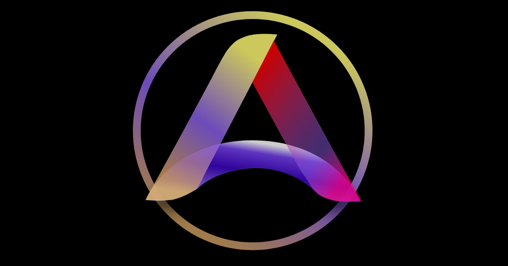

# AuraWall

AuraWall is a vector-first wallpaper generator built with React, TypeScript and SVG. The editor and the promo site are both static deployments, so the full product works without a backend and can be published on GitHub Pages.



## What Exists Today

- 10 visual engines: `boreal`, `chroma`, `lava`, `midnight`, `geometrica`, `glitch`, `sakura`, `ember`, `oceanic`, `astra`
- 1 engine active at a time in the editor
- 3 curated library presets per engine
- `Randomizar Motor Atual` that preserves the identity of the selected preset when one is active
- `Variacoes Inspiradas` generated from the current canvas, not from an unrelated engine default
- real preset thumbnails rendered from the same SVG config used by the canvas
- export to `JPG`, `PNG` and source `SVG`

## Product Model

AuraWall has two surfaces:

- `src/`: the main editor app
- `website/`: the promo site

The editor is driven by `WallpaperConfig`. Engines generate and transform that config, `WallpaperRenderer` turns it into SVG, and export flows rasterize when needed.

## Engine Workflow

Each engine has:

- engine metadata in `src/engines/*.ts`
- 3 curated library presets in `src/constants.ts`
- engine-specific randomization rules
- inspired variation transforms derived from the current canvas

Canonical promo imagery is also preset-based. Each engine maps to one official preset through `CANONICAL_ENGINE_PRESET_IDS` in `src/constants.ts`, and the promo/site background SVGs are regenerated from those presets.

## Development

### Prerequisites

- Node.js 22.12+
- npm

### Install

```bash
npm ci
```

### Run

```bash
npm run dev
```

### Main Scripts

```bash
npm run lint
npm run build:app
npm run build:promo
npm run generate:engine-samples
npm run generate:promo-assets
```

## CLI Image Generation

The repo includes a CLI renderer for sampling engines without opening the UI:

```bash
npm run generate:engine-samples -- --engines=midnight,glitch,sakura --count=2 --width=2560 --height=1440 --formats=jpg
```

This uses the real engine definitions and the real `WallpaperRenderer`, and writes outputs to `node_modules/.cache/aurawall/cli-samples/` (override with `--output=<dir>`). That directory is a regenerable, git-ignored build artifact — nothing you need to keep.

## Promo Asset Generation

The promo site does not invent engine illustrations separately. Instead, it consumes canonical SVGs generated from one official preset per engine:

```bash
npm run generate:promo-assets
```

This updates both:

- `public/bg-*.svg`
- `website/public/bg-*.svg`

## Key Files

- `src/constants.ts`: defaults, preset library, canonical promo preset mapping
- `src/engines/*.ts`: engine metadata, randomizers, inspired variation rules
- `src/components/WallpaperRenderer.tsx`: SVG renderer
- `src/App.tsx`: editor flow, preset selection, randomization, export
- `website/src/data/engines.ts`: promo catalog metadata

## Quality Gates

There are three layers of verification, and only the first one runs automatically.

| Layer | Command | Measures | Needs a browser | Runs on |
|---|---|---|---|---|
| **Bundle size** | `npm run test:perf` | size of `dist/app` + `dist/client` against hardcoded limits | no | **CI and every release** |
| **Browser audits** | `npm run audit` | Lighthouse scores for accessibility, best-practices and SEO | yes | manually |
| **Navigation regressions** | `npm run perf:gate` | LCP / TBT / CLS against `performance/baseline/` | yes | manually |

`test:perf` is the automatic gate. The other two are manual by design: they need a browser, so
they would be the slowest job in the pipeline, and the navigation baseline has to be regenerated
whenever a build legitimately changes.

## Running the manual layers

`perf:gate` takes a Lighthouse JSON and compares it against `performance/baseline/`. There are two
audit runners, and they write to different paths — both under `performance-reports/`, which is
git-ignored.

**`npm run audit`** uses the orchestrator (`scripts/audit/runner.cjs`), whose targets come from
`scripts/config/audit.config.cjs` and point at `localhost`. It writes a Markdown summary plus the
raw JSON:

```bash
npm run audit
npm run perf:gate -- performance-reports/promo/<YYYY-MM-DD>/raw/Audit_<timestamp>_OK.json
```

**`npm run audit:promo:prod`** and **`npm run audit:promo:mobile`** use
`scripts/audit/landing.cjs`, which audits a URL rather than an orchestrator target. This is the
only way to measure the **published** site, because `runner.cjs` only knows localhost. It writes to
a flat directory:

```bash
npm run audit:promo:prod
npm run perf:gate -- performance-reports/raw-data/Audit_<timestamp>_OK.json
```

The baseline is picked from the form factor:
`performance/baseline/navigation.desktop.json` or `.mobile.json`.

Before shipping changes, run:

```bash
npm run lint
npm run build:app
npm run build:promo
```
