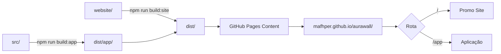

# AuraWall Promo Site - Guia de Referência Completo

> **Versão:** 1.1.0  
> **Última atualização:** 2024-12-10  
> **Autor:** @mafhper

Este documento serve como referência completa para criar sites promocionais com o mesmo padrão de qualidade, design e usabilidade do AuraWall. Destinado a desenvolvedores humanos e sistemas de IA.

---

## 📐 Índice

1. [Arquitetura do Sistema](#1-arquitetura-do-sistema)
2. [Design System](#2-design-system)
3. [Estrutura de Páginas](#3-estrutura-de-páginas)
4. [Componentes Reutilizáveis](#4-componentes-reutilizáveis)
5. [Integração com GitHub](#5-integração-com-github)
6. [Build e Deploy](#6-build-e-deploy)
7. [Internacionalização](#7-internacionalização)
8. [Adaptando Projetos Existentes](#8-adaptando-projetos-existentes)
9. [Convenções e Boas Práticas](#9-convenções-e-boas-práticas)

---

## 1. Arquitetura do Sistema

### 1.1 Estrutura de Repositório Tripla

O padrão AuraWall utiliza uma arquitetura integrada:

📦 aurawall/                          # Repositório único
├── 📂 src/                           # Aplicação principal (React + Vite)
│   ├── components/                   # UI da aplicação
│   └── ...
│
├── 📂 website/                       # Promo site (Subprojeto Vite independente)
│   ├── src/                          # UI do site de marketing
│   ├── vite.config.ts                # Configuração com base '/' 
│   └── package.json                  # Dependências isoladas (opcional)
│
├── 📂 dist/                          # Pasta de Build Final (Deploy root)
│   ├── index.html                    # Home do Promo Site
│   └── 📂 app/                       # Aplicação Principal (subdiretório)
│       └── index.html
│
├── 📂 .github/workflows/             # Automação de deploy
├── 📂 _desenvolvimento/              # Docs e assets de design
└── package.json                      # Scripts de orquestração (Workspaces)

### 1.2 Fluxo de Build



### 1.3 Scripts NPM

```json
{
  "scripts": {
    "dev": "vite",                                                // App principal (porta 3000)
    "dev:site": "vite --config website/vite.config.ts",           // Promo site (porta 5173)
    "dev:all": "concurrently \"npm run dev\" \"npm run dev:site\"", // Roda ambos simultaneamente
    
    "build:app": "vite build",                                    // Compila app para dist/app
    "build:site": "vite build --config website/vite.config.ts",   // Compila site para dist/
    "build:all": "npm run build:site && npm run build:app",       // Sequência crítica: Site (limpa) -> App (anexa)
    "build": "npm run build:all",
    
    "preview": "vite preview"
  }
}
```

### 1.4 Configuração Vite do Promo Site

```typescript
// website/vite.config.ts
import { defineConfig } from 'vite';
import react from '@vitejs/plugin-react';
import path from 'path';

export default defineConfig(({ command }) => ({
  plugins: [react()],
  root: path.resolve(__dirname),
  base: command === 'serve' ? '/' : '/aurawall/',  // Base para GitHub Pages
  build: {
    outDir: '../dist',                             // Sai para a raiz de dist/
    emptyOutDir: true,                             // Limpa dist antes de buildar
  },
  server: {
    port: 5173,
    proxy: {
      '/app': {                                    // Proxy reverso para simular produção localmente
        target: 'http://localhost:3000',
        changeOrigin: true,
        rewrite: (path) => path.replace(/^\/app/, '')
      }
    }
  }
}));
```

---

## 2. Design System

### 2.1 Paleta de Cores

#### Cores Base (Tailwind)
```css
/* Fundo principal */
--bg-primary: black (#000000)

/* Textos */
--text-primary: white (#FFFFFF)
--text-secondary: zinc-400 (#a1a1aa)
--text-muted: zinc-500 (#71717a)
--text-subtle: zinc-600 (#52525b)

/* Bordas */
--border-subtle: white/5 (rgba(255,255,255,0.05))
--border-light: white/10 (rgba(255,255,255,0.1))
```

#### Cores de Destaque
```css
/* Gradientes e acentos */
--accent-purple: #a855f7 (purple-500)
--accent-pink: #ec4899 (pink-500)
--accent-blue: #3b82f6 (blue-500)
--accent-green: #22c55e (green-500)
--accent-cyan: #06b6d4 (cyan-500)
--accent-yellow: #eab308 (yellow-500)
--accent-orange: #f97316 (orange-500)
--accent-teal: #14b8a6 (teal-500)
```

#### Opacidades Padrão
```css
/* Backgrounds com cor */
bg-{color}-500/5   /* 5% - Muito sutil */
bg-{color}-500/10  /* 10% - Sutil */
bg-{color}-500/20  /* 20% - Visível */

/* Bordas com cor */
border-{color}-500/20  /* 20% - Padrão */
border-{color}-500/30  /* 30% - Hover */
border-{color}-500/50  /* 50% - Ativo */
```

### 2.2 Tipografia

```css
/* Font family - System fonts com fallbacks */
font-family: system-ui, -apple-system, BlinkMacSystemFont, 
             'Segoe UI', Roboto, sans-serif;

/* Font mono para código */
font-family: ui-monospace, SFMono-Regular, 'SF Mono', 
             Monaco, 'Cascadia Code', monospace;
```

#### Escalas de Texto
```css
/* Hero titles */
text-5xl md:text-7xl    /* 48px → 72px */
font-bold

/* Section titles */
text-3xl md:text-4xl    /* 30px → 36px */
font-bold

/* Card titles */
text-xl md:text-2xl     /* 20px → 24px */
font-bold

/* Body text */
text-lg                  /* 18px */
leading-relaxed

/* Small text */
text-sm                  /* 14px */
text-zinc-400

/* Micro text (tags, labels) */
text-xs                  /* 12px */
uppercase tracking-wider font-bold
```

### 2.3 Espaçamentos

#### Padding de Containers
```css
/* Container principal */
container mx-auto px-6 max-w-5xl

/* Variações de max-width */
max-w-4xl   /* Páginas de conteúdo */
max-w-5xl   /* Padrão */
max-w-6xl   /* Seções largas */
```

#### Margins Verticais
```css
/* Entre seções */
mb-20       /* 80px - Padrão */
mb-24       /* 96px - Maior separação */
mb-32       /* 128px - Separação forte */

/* Entre elementos */
mb-4        /* 16px - Próximos */
mb-6        /* 24px - Relacionados */
mb-8        /* 32px - Separados */
mb-12       /* 48px - Distintos */
```

#### Padding de Cards
```css
/* Cards padrão */
p-6         /* 24px */
p-8         /* 32px - Cards médios */
p-10        /* 40px - Cards grandes */
p-12        /* 48px - CTAs */
```

### 2.4 Gradientes

#### Gradiente de Texto
```css
bg-clip-text text-transparent 
bg-gradient-to-r from-purple-400 via-pink-400 to-blue-400
```

#### Gradiente de Fundo (Sutil)
```css
/* Footer transition */
bg-gradient-to-t from-purple-900/20 via-transparent to-transparent

/* Card inner glow */
bg-gradient-to-br from-purple-500/5 via-transparent to-blue-500/5

/* Section backgrounds */
bg-gradient-to-b from-black via-zinc-950/50 to-black
```

#### Gradiente de Botão/Ícone
```css
bg-gradient-to-br from-purple-500 to-pink-500
```

### 2.5 Sombras e Glows

```css
/* Sombra de botão branco */
shadow-[0_0_60px_-10px_rgba(255,255,255,0.4)]

/* Sombra hover (roxo) */
shadow-[0_0_100px_-5px_rgba(168,85,247,0.4)]

/* Sombra de ícone */
shadow-lg shadow-purple-500/30

/* Glow de elemento */
shadow-[0_0_50px_rgba(255,255,255,0.2)]
```

### 2.6 Efeitos Visuais

#### Glass Panel (Glassmorphism)
```css
.glass-panel {
  @apply bg-zinc-900/50 backdrop-blur-md border border-white/10;
}
```

#### Card Hover Effects
```css
.card-hover {
  @apply transition-all duration-300 hover:scale-[1.02];
}

.card-glow {
  @apply hover:shadow-lg hover:shadow-purple-500/10;
}
```

#### Animações de Entrada
```css
animate-in fade-in slide-in-from-bottom-4 duration-700

/* Com delay escalonado */
style={{ animationDelay: `${index * 100}ms` }}
```

### 2.7 Bordas Arredondadas

```css
/* Escala de border-radius */
rounded-lg      /* 8px - Botões pequenos */
rounded-xl      /* 12px - Cards pequenos */
rounded-2xl     /* 16px - Cards médios */
rounded-3xl     /* 24px - Cards grandes, CTAs */
rounded-full    /* Pills, badges, avatares */
```

### 2.8 Identidade Visual (Assets)
- **Logo Principal:** `/icon-light.svg` (SVG otimizado).
- **Favicon:** `/favicon.svg` ou `/favicon.ico`.
- **Origem dos Arquivos:** `_desenvolvimento/img/icon-forge-assets-3`.

---

## 3. Estrutura de Páginas

### 3.1 Anatomia de uma Página

```tsx
export default function PageName() {
  const { t } = useTranslation();

  return (
    <div className="min-h-screen bg-black text-white pt-40 pb-20 animate-in fade-in slide-in-from-bottom-4 duration-700">
      <div className="container mx-auto px-6 max-w-5xl">
        
        {/* Hero Section */}
        <div className="text-center mb-20">
          <h1 className="text-5xl md:text-7xl font-bold mb-6">
            {t('page.title')}
          </h1>
          <p className="text-xl text-zinc-400 max-w-2xl mx-auto leading-relaxed">
            {t('page.subtitle')}
          </p>
        </div>

        {/* Content Sections */}
        <section className="mb-20">
          {/* ... */}
        </section>

      </div>
    </div>
  );
}
```

### 3.2 Hero Sections com Background

```tsx
{/* Hero with Background */}
<div className="relative h-[70vh] min-h-[500px] flex items-center justify-center overflow-hidden">
  {/* Background Renderer */}
  <div className="absolute inset-0 opacity-40">
    <WallpaperRenderer config={heroConfig} className="w-full h-full" lowQuality />
  </div>
  
  {/* Gradient overlay */}
  <div className="absolute inset-0 bg-gradient-to-b from-black/50 via-transparent to-black" />
  
  {/* Content */}
  <div className="container mx-auto px-6 max-w-6xl relative z-10">
    {/* ... */}
  </div>
</div>
```

### 3.3 Grid Layouts

```tsx
{/* 2 Columns */}
<div className="grid md:grid-cols-2 gap-6">

{/* 3 Columns */}
<div className="grid md:grid-cols-3 gap-6">

{/* Alternating layout (image/text) */}
<div className={`flex flex-col ${index % 2 === 0 ? 'lg:flex-row' : 'lg:flex-row-reverse'} gap-12 items-center`}>
```

### 3.4 Páginas Existentes

| Rota | Arquivo | Propósito |
|------|---------|-----------|
| `/` | `Home.tsx` | Landing page principal |
| `/creation` | `Creation.tsx` | Modos de criação |
| `/creation/boreal` | `CreationBoreal.tsx` | Detalhes do modo Boreal |
| `/creation/chroma` | `CreationChroma.tsx` | Detalhes do modo Chroma |
| `/creation/animation` | `CreationAnimation.tsx` | Detalhes de animação |
| `/creation/procedural` | `CreationProcedural.tsx` | Inteligência procedural |
| `/architecture` | `Tech.tsx` | Stack técnica + Sistema de Compartilhamento V2 |
| `/gallery` | `Gallery.tsx` | Galeria de presets |
| `/changes` | `Changes.tsx` | Roadmap e changelog |
| `/about` | `About.tsx` | Sobre o projeto |

#### Nota: Seção de Compartilhamento V2 (Tech.tsx)

A página Tech.tsx inclui uma seção documentando o sistema de URLs compactas:
- **Otimizações V2:** Array notation, IDs removidos, cores compactas
- **Comparativo de Tamanho:** Gráfico visual mostrando redução de 78%
- **Formatos Suportados:** `#c=...` (V2), `#cfg=...` (legacy), `?preset=id`

---

## 4. Componentes Reutilizáveis

### 4.1 CodeWindow

Janela estilo macOS para exibição de código:

```tsx
// website/src/components/CodeWindow.tsx
interface CodeWindowProps {
  filename?: string;
  children: React.ReactNode;
  className?: string;
}

export default function CodeWindow({ filename, children, className = '' }: CodeWindowProps) {
  return (
    <div className={`w-full bg-black/80 rounded-xl border border-white/10 font-mono text-xs md:text-sm text-zinc-400 shadow-2xl overflow-hidden ${className}`}>
      <div className="flex items-center gap-2 px-4 py-3 border-b border-white/10 bg-white/5">
        <div className="w-3 h-3 rounded-full bg-red-500/50"/>
        <div className="w-3 h-3 rounded-full bg-yellow-500/50"/>
        <div className="w-3 h-3 rounded-full bg-green-500/50"/>
        {filename && <span className="ml-4 text-xs text-zinc-600">{filename}</span>}
      </div>
      <div className="p-6 overflow-x-auto">
        {children}
      </div>
    </div>
  );
}
```

**Uso:**
```tsx
<CodeWindow filename="example.ts">
<pre>{`const config = {
  shapes: 12,
  blur: 80
};`}</pre>
</CodeWindow>
```

### 4.2 GalleryCard

Card de preset com download e preview:

```tsx
// website/src/components/GalleryCard.tsx
interface GalleryCardProps {
  preset: typeof PRESETS[0];
  className?: string;
}
```

### 4.3 ScrollToTop

Reseta scroll ao navegar entre páginas:

```tsx
// Definido em App.tsx
const ScrollToTop = () => {
  const { pathname } = useLocation();
  
  React.useEffect(() => {
    window.scrollTo(0, 0);
  }, [pathname]);
  
  return null;
};

// Uso dentro do Router
<Router>
  <ScrollToTop />
  <Routes>...</Routes>
</Router>
```

---

## 5. Integração com GitHub

### 5.1 Busca de Commits

A página `/changes` busca commits diretamente da API do GitHub:

```tsx
// Interface TypeScript
interface GitHubCommit {
  sha: string;
  commit: {
    message: string;
    author: {
      name: string;
      date: string;
    };
  };
  html_url: string;
}

// Fetch no useEffect
useEffect(() => {
  fetch('https://api.github.com/repos/mafhper/aurawall/commits?per_page=20')
    .then(res => res.ok ? res.json() : Promise.reject())
    .then((data: GitHubCommit[]) => {
      setCommits(data);
      setLoadingCommits(false);
    })
    .catch(() => {
      console.log('Could not fetch GitHub commits');
      setLoadingCommits(false);
    });
}, []);
```

### 5.2 Exibição de Commits

```tsx
{/* Mostra 2 commits inicialmente */}
const displayedCommits = showAllCommits ? commits : commits.slice(0, 2);

{/* Botão de expansão FORA dos cards */}
{commits.length > 2 && (
  <button onClick={() => setShowAllCommits(!showAllCommits)}>
    {showAllCommits ? 'Mostrar Menos' : `Ver Histórico Completo (${commits.length - 2} mais)`}
  </button>
)}
```

### 5.3 Formatação de Data

```tsx
const formatDate = (dateString: string) => {
  const date = new Date(dateString);
  return date.toLocaleDateString('pt-BR', { 
    day: '2-digit', 
    month: 'short', 
    year: 'numeric' 
  });
};
```

### 5.4 Fallback Estático

Se a API falhar, usa dados estáticos:

```tsx
const staticChangelog: ChangelogEntry[] = [
  {
    version: '0.1.0',
    date: '2024-12-09',
    title: 'Lançamento Inicial',
    description: '...',
    type: 'feature',
  },
];

// No JSX
{commits.length > 0 ? (
  /* Renderiza commits do GitHub */
) : (
  /* Fallback para changelog estático */
)}
```

---

## 6. Build e Deploy

### 6.1 GitHub Actions Workflow

```yaml
# .github/workflows/deploy.yml
name: Deploy to GitHub Pages

on:
  push:
    branches: ["main"]
  workflow_dispatch:

permissions:
  contents: read
  pages: write
  id-token: write

concurrency:
  group: "pages"
  cancel-in-progress: true

jobs:
  build:
    runs-on: ubuntu-latest
    steps:
      - name: Checkout
        uses: actions/checkout@v4

      - name: Setup Node
        uses: actions/setup-node@v4
        with:
          node-version: "20"
          cache: 'npm'

      - name: Install Dependencies
        run: npm ci

      - name: Build
        run: npm run build
        # Executa build:all -> build:site (gera dist/) -> build:app (gera dist/app/)

      - name: Upload artifact
        uses: actions/upload-pages-artifact@v3
        with:
          path: ./dist

  deploy:
    environment:
      name: github-pages
      url: ${{ steps.deployment.outputs.page_url }}
    runs-on: ubuntu-latest
    needs: build
    steps:
      - name: Deploy to GitHub Pages
        id: deployment
        uses: actions/deploy-pages@v4
```

### 6.2 Estrutura Final do Deploy

```
dist/
├── index.html          # Promo site (home)
├── assets/             # Assets do promo site
├── app/                # Aplicação principal
│   └── index.html
└── *.svg, *.png        # Assets estáticos
```

### 6.3 Configuração de Base Path

```typescript
// vite.config.ts (app principal)
export default defineConfig(({ command }) => ({
  base: command === 'serve' ? '/' : '/aurawall/app/', // Caminho relativo da App
  build: {
    outDir: 'dist/app',                               // Subdiretório dentro de dist
    emptyOutDir: true,
  }
  // ...
}));

// website/vite.config.ts (promo site)
export default defineConfig(({ command }) => ({
  base: command === 'serve' ? '/' : '/aurawall/',     // Caminho raiz do Site
  build: {
    outDir: '../dist',                                // Raiz de dist
    emptyOutDir: true,                                // ATENÇÃO: Limpa dist/ inteiro antes
  }
  // ...
}));
```

---

## 7. Internacionalização (i18n)

> **Importância:** Configurar i18n desde o início é fundamental. Migrar textos hardcoded depois é trabalhoso e propenso a erros. Comece com i18n no primeiro commit.

### 7.1 Por que Configurar Desde o Início

1. **Evita retrabalho** - Adicionar traduções depois exige refatoração de todos os componentes
2. **Padrão de código** - Força o uso consistente de chaves de tradução
3. **Escalabilidade** - Adicionar novos idiomas se torna trivial
4. **Contexto preservado** - Ao escrever o texto original, você lembra do contexto

### 7.2 Dependências Necessárias

```bash
npm install i18next react-i18next i18next-browser-languagedetector
```

### 7.3 Estrutura do Arquivo i18n.ts

```typescript
// website/src/i18n.ts

/**
 * i18n Configuration
 * 
 * Configuração de internacionalização usando i18next
 * Suporta N idiomas (ex: en, pt-BR, es, fr, de, it, ja, zh)
 * 
 * @module i18n
 */

import i18n from 'i18next';
import { initReactI18next } from 'react-i18next';
import LanguageDetector from 'i18next-browser-languagedetector';

const resources = {
  en: {
    translation: {
      // ============================
      // NAVEGAÇÃO
      // ============================
      nav: {
        home: "Home",
        creation: "Creation",
        arch: "Architecture",
        gallery: "Gallery",
        changes: "Changes",
        about: "About",
        launch: "Launch App"
      },

      // ============================
      // HOMEPAGE
      // ============================
      hero: {
        title: "Generate Infinite Wallpapers",
        desc: "Create unique, high-resolution abstract wallpapers...",
        cta_primary: "Launch App",
        cta_secondary: "Explore Styles"
      },

      features: {
        title: "Why Project Name?",
        feat_1_title: "Feature One",
        feat_1_desc: "Description of feature one...",
        // Continue numerando: feat_2_*, feat_3_*, etc.
      },

      // ============================
      // PÁGINAS DE CONTEÚDO
      // ============================
      creation: {
        title: "Creation Modes",
        subtitle: "Choose your style...",
        explore: "Explore",
        // Subchaves para cada modo
        boreal_title: "Boreal",
        boreal_short: "Soft & Ethereal",
        // ...
      },

      tech: {
        title: "Technical Architecture",
        subtitle: "How it works under the hood...",
        stack_title: "The Stack",
        stack_core: "Core: React 19 + TypeScript",
        stack_style: "Styling: Tailwind CSS v4",
        // Continue com stack_render, stack_export, etc.
      },

      gallery: {
        title: "Gallery",
        subtitle: "Explore the possibilities...",
        download: "Download",
        open_editor: "Open in Editor"
      },

      changes: {
        title: "Changelog",
        subtitle: "Follow the evolution...",
        roadmap_title: "Roadmap",
        changelog_title: "Version History",
        view_full_history: "View Full History",
        show_less: "Show Less",
        commits: "Commits"
      },

      about: {
        title: "About",
        subtitle: "The story behind the project...",
        bio: "Developer biography...",
        projects_title: "Other Projects",
        contribute_title: "Contribute",
        contribute_desc: "This project is open source...",
        repo_link: "View on GitHub"
      },

      // ============================
      // ELEMENTOS GLOBAIS
      // ============================
      footer: "© 2024 Project Name. Open Source.",

    }
  },

  'pt-BR': {
    translation: {
      // MESMA ESTRUTURA QUE 'en'
      // Traduza cada chave mantendo a hierarquia idêntica
      nav: {
        home: "Início",
        creation: "Criação",
        arch: "Arquitetura",
        gallery: "Galeria",
        changes: "Mudanças",
        about: "Sobre",
        launch: "Abrir App"
      },
      // ... continuar com todas as chaves
    }
  }
};

i18n
  .use(LanguageDetector)      // Detecta idioma do navegador
  .use(initReactI18next)       // Integra com React
  .init({
    resources,
    fallbackLng: 'en',         // Idioma padrão se não encontrar
    interpolation: { 
      escapeValue: false       // React já escapa XSS
    },
    detection: {
      order: ['localStorage', 'navigator'],  // Prioridade de detecção
      caches: ['localStorage']               // Onde armazenar preferência
    }
  });

export default i18n;
```

### 7.4 Organização das Chaves de Tradução

#### Convenção de Nomenclatura

```typescript
// Padrão: secao.elemento_variante

// Navegação
nav.home, nav.about, nav.launch

// Features
features.feat_1_title, features.feat_1_desc
features.feat_2_title, features.feat_2_desc

// Itens dinâmicos (roadmap, stack, etc.)
changes.roadmap_api_title, changes.roadmap_api_desc
tech.stack_core, tech.stack_style, tech.stack_render

// CTAs (Call to Action)
home_cta.title, home_cta.desc, home_cta.btn
```

#### Hierarquia Recomendada

```
translation/
├── nav.*                    # Navegação global
├── hero.*                   # Hero da homepage
├── features.*               # Cards de features
├── home_gallery.*           # Preview da galeria na home
├── home_cta.*               # CTA final da home
├── showcase.*               # Showcase de estilos
│
├── creation.*               # Página de criação
├── modes.*                  # Detalhes dos modos
│   ├── boreal_*
│   ├── chroma_*
│   └── animation_*
│
├── tech.*                   # Página de arquitetura
├── gallery.*                # Página de galeria
├── changes.*                # Página de changelog
├── about.*                  # Página sobre
│
└── footer                   # Footer global
```

### 7.5 Uso nos Componentes

#### Importação Básica

```tsx
import { useTranslation } from 'react-i18next';

export default function Component() {
  const { t } = useTranslation();
  
  return <h1>{t('hero.title')}</h1>;
}
```

#### Com Fallback (Recomendado)

```tsx
// Se a chave não existir, usa o texto fallback
{t('key.that.might.not.exist', 'Texto Fallback')}

// Útil durante desenvolvimento e para resiliência
{t('new.feature.title', 'Nova Funcionalidade')}
```

#### Chaves Dinâmicas (Para Listas)

```tsx
// Quando você tem arrays de itens
const items = [
  { id: 'api', title: 'API', description: '...' },
  { id: 'desktop', title: 'Desktop', description: '...' }
];

{items.map((item) => (
  <div key={item.id}>
    {/* Tenta carregar tradução, usa fallback do objeto */}
    <h3>{t(`changes.roadmap_${item.id}_title`, item.title)}</h3>
    <p>{t(`changes.roadmap_${item.id}_desc`, item.description)}</p>
  </div>
))}
```

#### Seletor de Idioma

```tsx
const { i18n } = useTranslation();

<select 
  onChange={(e) => i18n.changeLanguage(e.target.value)}
  value={i18n.language}
  className="bg-transparent text-xs uppercase"
>
  <option value="en">EN</option>
  <option value="pt-BR">PT</option>
  <option value="es">ES</option>
</select>
```

### 7.6 Mantendo as Traduções Atualizadas

#### Workflow Recomendado

1. **Ao criar novo componente:**
   - Primeiro, adicione as chaves no `i18n.ts` (inglês)
   - Use `t('chave')` no componente
   - Depois, adicione as traduções para outros idiomas

2. **Ao modificar texto existente:**
   - Atualize TODAS as traduções simultaneamente
   - Use `git grep` para encontrar usos da chave

3. **Auditoria periódica:**
   ```bash
   # Encontrar chaves não traduzidas
   grep -r "t('" src/ | grep -v "i18n.ts"
   ```

#### Checklist de Tradução

```markdown
Ao adicionar novo conteúdo:
- [ ] Chaves adicionadas em `en` (inglês)
- [ ] Traduções adicionadas em `pt-BR`
- [ ] Fallbacks definidos onde apropriado
- [ ] Testado em ambos os idiomas
```

### 7.7 Adicionando Novos Idiomas

```typescript
// 1. Adicione o novo idioma ao objeto resources
const resources = {
  en: { translation: { /* ... */ } },
  'pt-BR': { translation: { /* ... */ } },
  
  // Novo idioma
  es: {
    translation: {
      // Copie a estrutura de 'en' e traduza
      nav: {
        home: "Inicio",
        creation: "Creación",
        // ...
      }
    }
  }
};

// 2. Adicione ao seletor de idioma
<option value="es">ES</option>
```

### 7.8 Dicas de Performance

```typescript
// Não faça isso - cria nova função a cada render
<button onClick={() => t('button.text')}>

// Faça isso - traduz uma vez
const buttonText = t('button.text');
<button>{buttonText}</button>

// Para listas grandes, memoize
const translatedItems = useMemo(() => 
  items.map(item => ({
    ...item,
    label: t(`items.${item.id}`)
  })), 
  [t, items]
);
```

---

## 8. Adaptando Projetos Existentes

### 8.1 Projetos com Apenas Repo + App

Para adaptar um projeto que só tem repositório e aplicação principal (GitHub Pages servindo a app diretamente):

#### Passo 1: Criar Estrutura do Promo Site

```bash
mkdir -p website/src/{pages,components}
```

#### Passo 2: Criar package.json do Website

```json
{
  "name": "projeto-website",
  "private": true,
  "type": "module",
  "scripts": {
    "dev": "vite",
    "build": "vite build"
  },
  "dependencies": {
    "i18next": "^24.2.0",
    "i18next-browser-languagedetector": "^8.0.2",
    "lucide-react": "^0.460.0",
    "react": "^19.0.0",
    "react-dom": "^19.0.0",
    "react-i18next": "^15.4.0",
    "react-router-dom": "^7.0.2"
  }
}
```

#### Passo 3: Configurar Vite

```typescript
// website/vite.config.ts
import { defineConfig } from 'vite';
import react from '@vitejs/plugin-react';
import path from 'path';

export default defineConfig({
  plugins: [react()],
  root: 'website',
  base: '/',
  build: {
    outDir: 'dist',
    emptyOutDir: true
  },
  resolve: {
    alias: {
      '@app': path.resolve(__dirname, '../src')  // Acesso à app principal
    }
  }
});
```

#### Passo 4: Atualizar Scripts Principais

```json
// package.json (raiz)
{
  "scripts": {
    "dev": "vite",
    "dev:site": "vite --config website/vite.config.ts",
    "build": "vite build",
    "build:site": "vite build --config website/vite.config.ts",
    "build:all": "npm run build && npm run build:site"
  }
}
```

#### Passo 5: Mover App para Subpasta

Altere o `base` da app principal para `/app/`:

```typescript
// vite.config.ts
export default defineConfig({
  base: '/app/',
  // ...
});
```

#### Passo 6: Criar Workflow de Deploy

Use o workflow da Seção 6.1 como referência.

### 8.2 Checklist de Migração

- [ ] Criar pasta `website/src/`
- [ ] Copiar CSS global (`index.css`) ou importar da app
- [ ] Criar `website/src/main.tsx` e `website/src/App.tsx`
- [ ] Criar `website/index.html`
- [ ] Configurar `website/vite.config.ts`
- [ ] Atualizar scripts do `package.json` raiz
- [ ] Alterar `base` da app principal para `/app/`
- [ ] Criar workflow GitHub Actions
- [ ] Testar build local com `npm run build:all`
- [ ] Verificar links entre promo site e app

---

## 9. Convenções e Boas Práticas

### 9.1 Nomenclatura de Arquivos

```
PascalCase para componentes:  Home.tsx, GalleryCard.tsx
camelCase para utilitários:    svgGenerator.ts, colorUtils.ts
kebab-case para assets:        bg-boreal.svg, icon-logo.png
```

### 9.2 Estrutura de Componentes

```tsx
// 1. Imports (React, bibliotecas, componentes, utils)
import React from 'react';
import { useTranslation } from 'react-i18next';
import { IconName } from 'lucide-react';

// 2. Interfaces/Types
interface Props {
  // ...
}

// 3. Constantes locais
const ITEMS = [...];

// 4. Componente
export default function ComponentName() {
  // Hooks primeiro
  const { t } = useTranslation();
  const [state, setState] = useState();

  // Handlers
  const handleClick = () => {};

  // Render
  return (...);
}
```

### 9.3 Classes Tailwind Ordenadas

```tsx
// Ordem recomendada:
// 1. Layout (display, position, flex, grid)
// 2. Dimensões (w, h, min, max)
// 3. Espaçamento (p, m)
// 4. Background/Cores
// 5. Bordas
// 6. Tipografia
// 7. Efeitos (shadow, opacity, transform)
// 8. Transições/Animações

<div className="
  flex items-center justify-center    /* Layout */
  w-full h-64                          /* Dimensões */
  p-8 mb-6                             /* Espaçamento */
  bg-zinc-900/50                       /* Background */
  border border-white/10 rounded-2xl   /* Bordas */
  text-lg font-bold text-white         /* Tipografia */
  shadow-lg                            /* Efeitos */
  transition-all hover:scale-105       /* Transições */
" />
```

### 9.4 Comentários JSX

```tsx
{/* Section Name */}
<section>
  {/* Subsection */}
  <div>
    {/* Important note about this element */}
  </div>
</section>
```

### 9.5 Responsividade

```tsx
// Mobile-first com breakpoints Tailwind
text-base md:text-lg lg:text-xl        // Texto responsivo
p-4 md:p-8 lg:p-12                     // Padding responsivo
grid grid-cols-1 md:grid-cols-2 lg:grid-cols-3  // Grid responsivo
flex-col md:flex-row                   // Direção responsiva
```

### 9.6 Acessibilidade

```tsx
// Labels para elementos interativos
<button aria-label="Fechar menu">

// Alt para imagens


// Links externos
<a 
  href="..." 
  target="_blank" 
  rel="noopener noreferrer"
  title="Abre em nova aba"
>
```

---

## Apêndice A: Checklist de Qualidade

### Design
- [ ] Paleta de cores consistente
- [ ] Hierarquia tipográfica clara
- [ ] Espaçamentos uniformes
- [ ] Gradientes sutis, não exagerados
- [ ] Animações suaves (300-700ms)
- [ ] Efeitos hover em elementos interativos

### Código
- [ ] Componentes reutilizáveis
- [ ] i18n para todos os textos
- [ ] Fallbacks para dados externos
- [ ] Loading states
- [ ] Error handling

### Performance
- [ ] Lazy loading de imagens/componentes pesados
- [ ] Otimização de assets
- [ ] Mínimo de dependências

### SEO/Acessibilidade
- [ ] Títulos de página dinâmicos
- [ ] Meta descriptions
- [ ] Estrutura de headings correta
- [ ] Links acessíveis
- [ ] Contraste de cores adequado

---

## Apêndice B: Recursos Úteis

- **Lucide Icons:** https://lucide.dev/icons
- **Tailwind CSS:** https://tailwindcss.com/docs
- **React Router:** https://reactrouter.com
- **i18next:** https://www.i18next.com
- **GitHub API:** https://docs.github.com/en/rest

---

## Apêndice C: Exemplos Reais de Código

> Esta seção contém código real do projeto AuraWall para referência.

### C.1 App.tsx - Estrutura Principal e Navegação

```tsx
// website/src/App.tsx

import React, { useState, useEffect } from 'react';
import { createPortal } from 'react-dom';
import { BrowserRouter as Router, Routes, Route, Link, useLocation } from 'react-router-dom';
import { useTranslation } from 'react-i18next';
import { ChevronDown, Sparkles, Zap, Play, Menu, X, Shuffle } from 'lucide-react';
import './i18n'; 

// Imports de páginas
import Home from './pages/Home';
import Creation from './pages/Creation';
import Tech from './pages/Tech';
// ...

// ============================================================
// SCROLL TO TOP - Reseta scroll ao navegar
// ============================================================
const ScrollToTop = () => {
  const { pathname } = useLocation();
  
  React.useEffect(() => {
    window.scrollTo(0, 0);
  }, [pathname]);
  
  return null;
};

// ============================================================
// NAVLINK - Link de navegação com estado ativo
// ============================================================
const NavLink = ({ to, children }: { to: string, children: React.ReactNode }) => {
  const location = useLocation();
  const isActive = location.pathname === to || (to !== '/' && location.pathname.startsWith(to));
  
  return (
    <Link 
      to={to} 
      className={`px-4 py-2 rounded-full text-sm font-medium transition-all duration-300 ${
        isActive 
          ? 'text-white bg-white/10 shadow-inner' 
          : 'text-zinc-400 hover:text-white hover:bg-white/5'
      }`}
    >
      {children}
    </Link>
  );
};

// ============================================================
// NAVDROPDOWN - Menu dropdown com hover
// ============================================================
const NavDropdown = ({ 
  to, 
  title, 
  items 
}: { 
  to: string, 
  title: string, 
  items: Array<{ to: string, label: string, icon?: React.ElementType, key: string }> 
}) => {
  const [isOpen, setIsOpen] = useState(false);
  const location = useLocation();
  const isActive = location.pathname === to || location.pathname.startsWith(to);

  return (
    <div 
      className="relative group"
      onMouseEnter={() => setIsOpen(true)}
      onMouseLeave={() => setIsOpen(false)}
    >
      <Link 
        to={to} 
        className={`flex items-center gap-1 px-4 py-2 rounded-full text-sm font-medium transition-all ${
          isActive 
            ? 'text-white bg-white/10' 
            : 'text-zinc-400 hover:text-white hover:bg-white/5'
        }`}
      >
        {title}
        <ChevronDown size={14} className={`transition-transform ${isOpen ? 'rotate-180' : ''}`} />
      </Link>
      
      {/* Dropdown Panel */}
      <div className={`absolute top-full left-0 pt-2 z-50 transition-all duration-200 ${
        isOpen ? 'opacity-100 translate-y-0' : 'opacity-0 -translate-y-2 pointer-events-none'
      }`}>
        <div className="bg-zinc-900/95 backdrop-blur-xl border border-white/10 rounded-lg p-2 min-w-[200px] shadow-2xl">
          {items.map((item) => {
            const Icon = item.icon;
            return (
              <Link 
                key={item.key}
                to={item.to}
                className={`flex items-center gap-3 px-3 py-2 rounded-lg text-sm transition-all ${
                  location.pathname === item.to 
                    ? 'text-white bg-white/5' 
                    : 'text-zinc-400 hover:text-white'
                }`}
              >
                {Icon && <Icon size={16} className={location.pathname === item.to ? 'text-purple-400' : 'text-zinc-500'} />}
                <span className="font-medium">{item.label}</span>
              </Link>
            );
          })}
        </div>
      </div>
    </div>
  );
};

// ============================================================
// APP PRINCIPAL
// ============================================================
export default function App() {
  const { t, i18n } = useTranslation();

  const changeLanguage = (lng: string) => {
    i18n.changeLanguage(lng);
  };

  // Itens do dropdown de criação
  const creationItems = [
    { to: '/creation/boreal', label: t('creation.boreal_title', 'Boreal'), icon: Sparkles, key: 'boreal' },
    { to: '/creation/chroma', label: t('creation.chroma_title', 'Chroma'), icon: Zap, key: 'chroma' },
    { to: '/creation/animation', label: t('creation.anim_title', 'Animação'), icon: Play, key: 'animation' },
    { to: '/creation/procedural', label: t('procedural.title', 'Procedural'), icon: Shuffle, key: 'procedural' }
  ];

  return (
    <Router>
      <div className="min-h-screen bg-black text-white">
        
        {/* Header */}
        <div className="fixed top-0 inset-x-0 z-50">
          <nav className="container mx-auto px-6 py-4 flex items-center justify-between">
            {/* Logo */}
            <Link to="/" className="flex items-center gap-3 group">
              
              <span className="text-lg font-bold tracking-tight hidden sm:block">
                AuraWall
              </span>
            </Link>

            {/* Navigation */}
            <div className="hidden md:flex items-center gap-1">
              <NavLink to="/">{t('nav.home')}</NavLink>
              <NavDropdown 
                to="/creation" 
                title={t('nav.creation')} 
                items={creationItems} 
              />
              <NavLink to="/architecture">{t('nav.arch')}</NavLink>
              <NavLink to="/gallery">{t('nav.gallery')}</NavLink>
              <NavLink to="/changes">{t('nav.changes')}</NavLink>
              <NavLink to="/about">{t('nav.about')}</NavLink>
            </div>

            {/* Right Side */}
            <div className="flex items-center gap-3">
              {/* Language Selector */}
              <select 
                onChange={(e) => changeLanguage(e.target.value)} 
                value={i18n.language}
                className="bg-transparent text-xs text-zinc-400 font-medium focus:outline-none cursor-pointer hover:text-white uppercase"
              >
                <option value="en" className="bg-zinc-900">EN</option>
                <option value="pt-BR" className="bg-zinc-900">PT</option>
              </select>

              {/* Launch Button */}
              <a 
                href="/app/" 
                className="bg-white text-black hover:bg-zinc-200 font-bold py-2 px-6 rounded-full text-sm transition-all hidden sm:flex items-center gap-2"
              >
                {t('nav.launch')}
              </a>
            </div>
          </nav>
        </div>

        {/* Conteúdo */}
        <ScrollToTop />
        <div>
          <Routes>
            <Route path="/" element={<Home />} />
            <Route path="/creation" element={<Creation />} />
            {/* ... outras rotas */}
          </Routes>
        </div>
        
        {/* Footer Gradient Transition */}
        <div className="relative h-32 mt-16">
          <div className="absolute inset-0 bg-gradient-to-t from-purple-900/20 via-transparent to-transparent"></div>
        </div>
        
        {/* Footer */}
        <footer className="border-t border-white/10 py-12 text-center">
          <div className="flex justify-center gap-6 mb-8 text-zinc-500 flex-wrap px-6">
            <Link to="/creation" className="hover:text-white transition-colors">{t('nav.creation')}</Link>
            <Link to="/architecture" className="hover:text-white transition-colors">{t('nav.arch')}</Link>
            <Link to="/gallery" className="hover:text-white transition-colors">{t('nav.gallery')}</Link>
            <a href="https://github.com/mafhper/aurawall" target="_blank" rel="noopener noreferrer" className="hover:text-white transition-colors">GitHub</a>
          </div>
          <p className="text-zinc-600 text-sm">{t('footer')}</p>
        </footer>
      </div>
    </Router>
  );
}
```

---

### C.2 Changes.tsx - Integração com GitHub API

```tsx
// website/src/pages/Changes.tsx

import React, { useState, useEffect } from 'react';
import { useTranslation } from 'react-i18next';
import { GitCommit, Rocket, ChevronDown, ChevronUp, ExternalLink } from 'lucide-react';

// ============================================================
// INTERFACES
// ============================================================
interface GitHubCommit {
  sha: string;
  commit: {
    message: string;
    author: {
      name: string;
      date: string;
    };
  };
  html_url: string;
}

// ============================================================
// DADOS ESTÁTICOS (Fallback)
// ============================================================
const roadmapItems = [
  {
    id: 'api',
    title: 'API Pública',
    description: 'Acesso programático para gerar wallpapers via REST API.',
    status: 'in-progress' as const,
  },
  {
    id: 'desktop',
    title: 'App Desktop',
    description: 'Aplicação nativa para Windows, macOS e Linux.',
    status: 'planned' as const,
  },
  // ... mais itens
];

const statusColors = {
  'completed': 'bg-green-500',
  'in-progress': 'bg-yellow-500',
  'planned': 'bg-zinc-600',
};

// ============================================================
// COMPONENTE PRINCIPAL
// ============================================================
export default function Changes() {
  const { t } = useTranslation();
  
  // Estados
  const [commits, setCommits] = useState<GitHubCommit[]>([]);
  const [showAllCommits, setShowAllCommits] = useState(false);
  const [loadingCommits, setLoadingCommits] = useState(true);

  // ============================================================
  // FETCH DE COMMITS DO GITHUB
  // ============================================================
  useEffect(() => {
    fetch('https://api.github.com/repos/mafhper/aurawall/commits?per_page=20')
      .then(res => res.ok ? res.json() : Promise.reject())
      .then((data: GitHubCommit[]) => {
        setCommits(data);
        setLoadingCommits(false);
      })
      .catch(() => {
        console.log('Could not fetch GitHub commits');
        setLoadingCommits(false);
      });
  }, []);

  // ============================================================
  // FORMATAÇÃO DE DATA
  // ============================================================
  const formatDate = (dateString: string) => {
    const date = new Date(dateString);
    return date.toLocaleDateString('pt-BR', { 
      day: '2-digit', 
      month: 'short', 
      year: 'numeric' 
    });
  };

  // Mostra 2 commits ou todos
  const displayedCommits = showAllCommits ? commits : commits.slice(0, 2);

  return (
    <div className="min-h-screen bg-black text-white pt-40 pb-20">
      <div className="container mx-auto px-6 max-w-4xl">
        
        {/* Hero */}
        <div className="text-center mb-20">
          <h1 className="text-5xl md:text-7xl font-bold mb-6">{t('changes.title')}</h1>
          <p className="text-xl text-zinc-400">{t('changes.subtitle')}</p>
        </div>

        {/* ============================================================
            ROADMAP SECTION
            ============================================================ */}
        <div className="mb-24">
          <h2 className="text-3xl font-bold mb-8 flex items-center gap-3">
            <Rocket className="text-blue-400" />
            {t('changes.roadmap_title')}
          </h2>
          
          <div className="grid md:grid-cols-2 gap-4">
            {roadmapItems.map((item, index) => (
              <div 
                key={item.id}
                className="glass-panel border-white/5 rounded-2xl p-6 hover:border-blue-500/30 transition-all"
                style={{ animationDelay: `${index * 100}ms` }}
              >
                <div className="flex items-start justify-between gap-4">
                  <div>
                    {/* Chaves dinâmicas de i18n com fallback */}
                    <h3 className="font-bold text-lg mb-2">
                      {t(`changes.roadmap_${item.id}_title`, item.title)}
                    </h3>
                    <p className="text-sm text-zinc-400">
                      {t(`changes.roadmap_${item.id}_desc`, item.description)}
                    </p>
                  </div>
                  {/* Status Badge */}
                  <div className="flex items-center gap-2 shrink-0 bg-white/5 px-2 py-1 rounded-full">
                    <span className={`w-2 h-2 rounded-full ${statusColors[item.status]}`}></span>
                    <span className="text-xs text-zinc-500 uppercase font-bold">{item.status}</span>
                  </div>
                </div>
              </div>
            ))}
          </div>
        </div>

        {/* ============================================================
            VERSION HISTORY - COMMITS DO GITHUB
            ============================================================ */}
        <div className="mb-20">
          <h2 className="text-3xl font-bold mb-8 flex items-center gap-3">
            <GitCommit className="text-purple-400" />
            {t('changes.changelog_title')}
          </h2>
          
          {loadingCommits ? (
            // Loading State
            <div className="glass-panel rounded-2xl p-8 text-center">
              <div className="animate-pulse text-zinc-500">Carregando commits do GitHub...</div>
            </div>
          ) : commits.length > 0 ? (
            <div className="space-y-4">
              {/* Lista de Commits */}
              {displayedCommits.map((commit, index) => (
                <div 
                  key={commit.sha}
                  className="glass-panel rounded-xl p-5 border-l-4 border-l-purple-500/50 hover:border-l-purple-500 transition-all"
                  style={{ animationDelay: `${index * 100}ms` }}
                >
                  <div className="flex items-start gap-4">
                    {/* Ícone */}
                    <div className="w-10 h-10 rounded-full bg-purple-500/20 flex items-center justify-center shrink-0">
                      <GitCommit size={18} className="text-purple-400" />
                    </div>
                    
                    {/* Conteúdo */}
                    <div className="flex-1 min-w-0">
                      {/* Mensagem do commit (primeira linha) */}
                      <p className="text-white font-medium mb-1 truncate">
                        {commit.commit.message.split('\n')[0]}
                      </p>
                      {/* Metadados */}
                      <div className="flex items-center gap-3 text-xs text-zinc-500">
                        <span className="font-mono">{commit.sha.slice(0, 7)}</span>
                        <span>•</span>
                        <span>{commit.commit.author.name}</span>
                        <span>•</span>
                        <span>{formatDate(commit.commit.author.date)}</span>
                      </div>
                    </div>
                    
                    {/* Link para GitHub */}
                    <a 
                      href={commit.html_url}
                      target="_blank"
                      rel="noopener noreferrer"
                      className="text-zinc-500 hover:text-purple-400 transition-colors shrink-0"
                      title="Ver no GitHub"
                    >
                      <ExternalLink size={16} />
                    </a>
                  </div>
                </div>
              ))}

              {/* ============================================================
                  BOTÃO DE EXPANSÃO - FORA DOS CARDS
                  ============================================================ */}
              {commits.length > 2 && (
                <button 
                  onClick={() => setShowAllCommits(!showAllCommits)}
                  className="w-full py-4 flex items-center justify-center gap-2 text-sm font-bold uppercase tracking-widest text-purple-400 hover:text-purple-300 bg-purple-500/5 hover:bg-purple-500/10 border border-purple-500/20 rounded-xl transition-all"
                >
                  {showAllCommits ? (
                    <>
                      {t('changes.show_less', 'Mostrar Menos')} 
                      <ChevronUp size={16} />
                    </>
                  ) : (
                    <>
                      {t('changes.view_full_history', 'Ver Histórico Completo')} ({commits.length - 2} mais)
                      <ChevronDown size={16} />
                    </>
                  )}
                </button>
              )}

              {/* Link para GitHub */}
              <div className="text-center pt-4">
                <a 
                  href="https://github.com/mafhper/aurawall/commits/main"
                  target="_blank"
                  rel="noopener noreferrer"
                  className="inline-flex items-center gap-2 text-sm text-zinc-500 hover:text-purple-400 transition-colors"
                >
                  Ver todos os commits no GitHub
                  <ExternalLink size={14} />
                </a>
              </div>
            </div>
          ) : (
            // Fallback quando não há commits
            <div className="glass-panel rounded-2xl p-8 text-center text-zinc-500">
              Não foi possível carregar commits do GitHub.
            </div>
          )}
        </div>

      </div>
    </div>
  );
}
```

---

### C.3 Home.tsx - Hero com Randomizer e CTA

```tsx
// website/src/pages/Home.tsx (trechos principais)

import React, { useMemo, useState, useEffect } from 'react';
import { Link } from 'react-router-dom';
import { useTranslation } from 'react-i18next';
import { ArrowRight, RefreshCw, Wand2 } from 'lucide-react';
import { PRESETS } from '../../../src/constants';  // Importa da app principal!
import WallpaperRenderer from '../../../src/components/WallpaperRenderer';

const RANDOM_ACTIONS = ["Randomize", "Transform", "Remix", "Shuffle", "Evolve", "Mutate"];

export default function Home() {
  const { t } = useTranslation();
  
  // ============================================================
  // HERO COM PRESET ALEATÓRIO
  // ============================================================
  const [heroConfig, setHeroConfig] = useState(() => {
    const randomPreset = PRESETS[Math.floor(Math.random() * PRESETS.length)];
    return {
      ...randomPreset.config,
      animation: {
        ...randomPreset.config.animation,
        enabled: true,
        speed: 2,
        flow: 3
      }
    };
  });

  const [actionIndex, setActionIndex] = useState(0);
  const [isRotating, setIsRotating] = useState(false);

  // ============================================================
  // RANDOMIZER - Troca o preset do hero
  // ============================================================
  const handleRandomize = () => {
    setIsRotating(true);
    setTimeout(() => setIsRotating(false), 500);

    // Escolhe novo preset aleatório
    const availablePresets = PRESETS.filter(p => p.config !== heroConfig);
    const randomPreset = availablePresets[Math.floor(Math.random() * availablePresets.length)] || PRESETS[0];
    
    setHeroConfig({
      ...randomPreset.config,
      animation: {
        ...randomPreset.config.animation,
        enabled: true,
        speed: Math.random() * 1.5 + 0.5,
        flow: Math.random() * 1.5 + 0.5
      }
    });

    // Cicla o texto do botão
    setActionIndex((prev) => (prev + 1) % RANDOM_ACTIONS.length);
  };

  return (
    <div className="min-h-screen bg-black text-white">
      
      {/* ============================================================
          HERO SECTION COM BACKGROUND DINÂMICO
          ============================================================ */}
      <div className="relative min-h-screen flex items-center justify-center overflow-hidden">
        
        {/* Background - Usa WallpaperRenderer da app principal */}
        <div className="absolute inset-0 opacity-50">
          <WallpaperRenderer 
            config={heroConfig} 
            className="w-full h-full"
            lowQuality  // Otimização para performance
          />
        </div>
        
        {/* Gradient Overlay */}
        <div className="absolute inset-0 bg-gradient-to-b from-black/60 via-black/30 to-black" />
        
        {/* Conteúdo */}
        <div className="container mx-auto px-6 relative z-10 text-center">
          <h1 className="text-5xl md:text-7xl lg:text-8xl font-bold mb-6 leading-tight">
            {t('hero.title')}
          </h1>
          
          <p className="text-lg md:text-xl text-zinc-300 max-w-3xl mx-auto mb-12 leading-relaxed">
            {t('hero.desc')}
          </p>
          
          {/* Botões */}
          <div className="flex flex-col sm:flex-row justify-center gap-4">
            
            {/* Botão Randomizer */}
            <button 
              onClick={handleRandomize}
              className="group relative bg-zinc-900/80 hover:bg-zinc-800/90 text-white border border-white/10 hover:border-white/20 font-medium py-4 px-8 rounded-full flex items-center justify-center gap-3 backdrop-blur-sm transition-all duration-300"
            >
              <div className={`transition-transform duration-500 ${isRotating ? 'rotate-180' : ''}`}>
                <RefreshCw size={20} className="text-white/90" />
              </div>
              <span className="relative z-10 w-24 text-left">
                {RANDOM_ACTIONS[actionIndex]}
              </span>
              {/* Efeito hover */}
              <div className="absolute inset-0 bg-white/20 translate-y-full group-hover:translate-y-0 transition-transform duration-300 rounded-full" />
            </button>

            {/* Botão CTA Principal */}
            <a 
              href="/app/" 
              className="bg-white text-black hover:bg-zinc-100 font-bold py-4 px-10 rounded-full text-lg flex items-center justify-center gap-2 shadow-[0_0_60px_-10px_rgba(255,255,255,0.3)] transition-all transform hover:scale-105"
            >
              {t('hero.cta_primary')}
              <ArrowRight size={20} />
            </a>
            
          </div>
        </div>
      </div>

      {/* ============================================================
          CTA FINAL - Design Ilustrado
          ============================================================ */}
      <div className="py-32 relative overflow-hidden">
        {/* Elementos Decorativos */}
        <div className="absolute inset-0 pointer-events-none">
          {/* Orbes flutuantes */}
          <div className="absolute top-1/4 left-10 w-64 h-64 bg-purple-500/10 rounded-full blur-3xl animate-pulse" />
          <div className="absolute bottom-1/4 right-10 w-80 h-80 bg-blue-500/10 rounded-full blur-3xl animate-pulse" style={{ animationDelay: '1s' }} />
          
          {/* Grid pattern */}
          <div 
            className="absolute inset-0 opacity-[0.03]"
            style={{
              backgroundImage: `linear-gradient(white 1px, transparent 1px), linear-gradient(90deg, white 1px, transparent 1px)`,
              backgroundSize: '60px 60px'
            }}
          />
        </div>
        
        <div className="container mx-auto px-6 relative">
          <div className="max-w-4xl mx-auto">
            <div className="glass-panel rounded-3xl p-12 md:p-16 border border-white/10 relative overflow-hidden">
              {/* Inner glow */}
              <div className="absolute inset-0 bg-gradient-to-br from-purple-500/5 via-transparent to-blue-500/5" />
              
              <div className="relative z-10 text-center">
                {/* Ícone */}
                <div className="w-20 h-20 mx-auto mb-8 bg-gradient-to-br from-purple-500 to-pink-500 rounded-2xl flex items-center justify-center shadow-lg shadow-purple-500/30">
                  <Wand2 size={36} className="text-white" />
                </div>
                
                <h2 className="text-4xl md:text-6xl font-bold mb-6 bg-clip-text text-transparent bg-gradient-to-r from-white via-white to-zinc-400">
                  {t('home_cta.title')}
                </h2>
                
                <p className="text-xl md:text-2xl text-zinc-400 mb-10 max-w-2xl mx-auto">
                  {t('home_cta.desc')}
                </p>
                
                {/* Mini-lista de features */}
                <div className="flex flex-wrap justify-center gap-6 mb-12 text-sm text-zinc-500">
                  <span className="flex items-center gap-2">
                    <span className="w-2 h-2 bg-green-500 rounded-full" />
                    100% Gratuito
                  </span>
                  <span className="flex items-center gap-2">
                    <span className="w-2 h-2 bg-blue-500 rounded-full" />
                    Sem Registro
                  </span>
                  <span className="flex items-center gap-2">
                    <span className="w-2 h-2 bg-purple-500 rounded-full" />
                    Exportação Ilimitada
                  </span>
                </div>
                
                <a 
                  href="/app/" 
                  className="inline-flex items-center gap-3 bg-white text-black hover:bg-zinc-100 font-bold py-5 px-14 rounded-full text-lg shadow-[0_0_80px_-10px_rgba(255,255,255,0.5)] transition-all transform hover:scale-105 hover:shadow-[0_0_100px_-5px_rgba(168,85,247,0.4)]"
                >
                  {t('home_cta.btn')}
                  <ArrowRight size={22} />
                </a>
              </div>
            </div>
          </div>
        </div>
      </div>

    </div>
  );
}
```

---

### C.4 GalleryCard.tsx - Card com Download

```tsx
// website/src/components/GalleryCard.tsx

import React, { useRef, useState } from 'react';
import { useTranslation } from 'react-i18next';
import { Download, ExternalLink } from 'lucide-react';
import WallpaperRenderer from '../../../src/components/WallpaperRenderer';
import { PRESETS } from '../../../src/constants';

interface GalleryCardProps {
  preset: typeof PRESETS[0];
  className?: string;
}

export default function GalleryCard({ preset, className = '' }: GalleryCardProps) {
  const { t } = useTranslation();
  const svgRef = useRef<SVGSVGElement>(null);
  const [isHovered, setIsHovered] = useState(false);

  // ============================================================
  // FUNÇÃO DE DOWNLOAD
  // ============================================================
  const handleDownload = async () => {
    if (!svgRef.current) return;

    try {
      // Serializa o SVG
      const serializer = new XMLSerializer();
      const svgString = serializer.serializeToString(svgRef.current);
      
      // Cria canvas para rasterização
      const canvas = document.createElement('canvas');
      canvas.width = 1920;
      canvas.height = 1080;
      const ctx = canvas.getContext('2d');
      
      if (!ctx) return;

      // Carrega SVG como imagem
      const img = new Image();
      const blob = new Blob([svgString], { type: 'image/svg+xml' });
      const url = URL.createObjectURL(blob);

      img.onload = () => {
        ctx.drawImage(img, 0, 0, canvas.width, canvas.height);
        URL.revokeObjectURL(url);

        // Baixa como PNG
        const link = document.createElement('a');
        link.download = `${preset.id}-wallpaper.png`;
        link.href = canvas.toDataURL('image/png');
        link.click();
      };

      img.src = url;

    } catch (error) {
      console.error('Download failed:', error);
    }
  };

  return (
    <div 
      className={`group relative rounded-2xl overflow-hidden bg-zinc-900 transition-all duration-500 ${className} ${
        isHovered ? 'scale-[1.02] shadow-2xl shadow-purple-500/20' : ''
      }`}
      onMouseEnter={() => setIsHovered(true)}
      onMouseLeave={() => setIsHovered(false)}
    >
      {/* Preview do Wallpaper */}
      <WallpaperRenderer 
        ref={svgRef}
        config={preset.config} 
        className="w-full h-full absolute inset-0"
      />
      
      {/* Overlay com ações (aparece no hover) */}
      <div className={`absolute inset-0 bg-gradient-to-t from-black/80 via-black/20 to-transparent 
        flex flex-col justify-end p-4 transition-opacity duration-300 ${
        isHovered ? 'opacity-100' : 'opacity-0'
      }`}>
        <div className="flex items-center justify-between">
          <span className="font-medium text-sm">{preset.name}</span>
          
          <div className="flex gap-2">
            {/* Botão Abrir no Editor */}
            <a 
              href={`/app/?preset=${preset.id}`}
              className="w-10 h-10 bg-white/10 hover:bg-white/20 rounded-full flex items-center justify-center transition-colors"
              title={t('gallery.open_editor')}
            >
              <ExternalLink size={16} />
            </a>
            
            {/* Botão Download */}
            <button 
              onClick={handleDownload}
              className="w-10 h-10 bg-purple-500 hover:bg-purple-400 rounded-full flex items-center justify-center transition-colors"
              title={t('gallery.download')}
            >
              <Download size={16} />
            </button>
          </div>
        </div>
      </div>
    </div>
  );
}
```

---

### C.5 CodeWindow.tsx - Janela de Código

```tsx
// website/src/components/CodeWindow.tsx

import React from 'react';

interface CodeWindowProps {
  filename?: string;
  children: React.ReactNode;
  className?: string;
}

/**
 * Componente de janela de código estilo macOS
 * 
 * @example
 * <CodeWindow filename="config.ts">
 *   <pre>{`const x = 1;`}</pre>
 * </CodeWindow>
 */
export default function CodeWindow({ filename, children, className = '' }: CodeWindowProps) {
  return (
    <div className={`w-full bg-black/80 rounded-xl border border-white/10 font-mono text-xs md:text-sm text-zinc-400 shadow-2xl overflow-hidden ${className}`}>
      
      {/* Barra de título com botões macOS */}
      <div className="flex items-center gap-2 px-4 py-3 border-b border-white/10 bg-white/5">
        <div className="w-3 h-3 rounded-full bg-red-500/50"/>
        <div className="w-3 h-3 rounded-full bg-yellow-500/50"/>
        <div className="w-3 h-3 rounded-full bg-green-500/50"/>
        {filename && <span className="ml-4 text-xs text-zinc-600">{filename}</span>}
      </div>
      
      {/* Conteúdo do código */}
      <div className="p-6 overflow-x-auto">
        {children}
      </div>
      
    </div>
  );
}
```

---

*Este documento foi gerado para o projeto AuraWall e pode ser adaptado para outros projetos seguindo o mesmo padrão de qualidade.*

